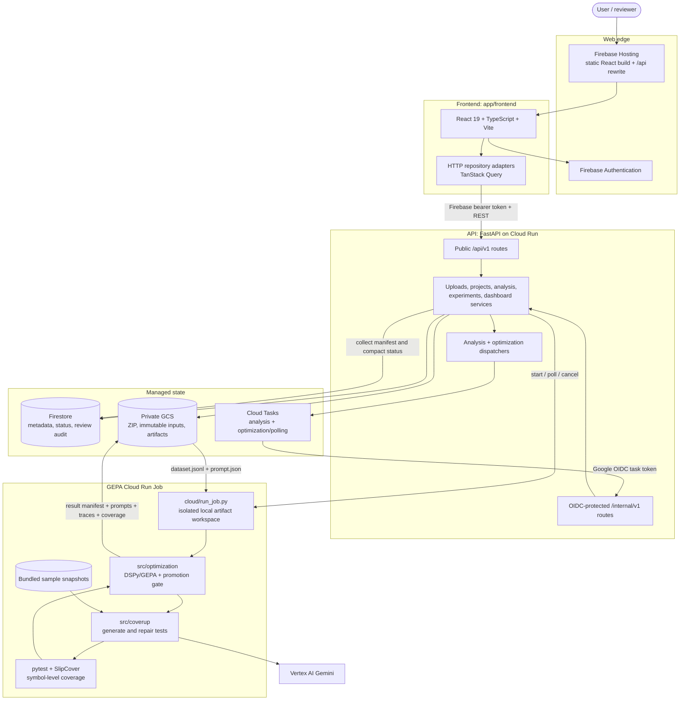
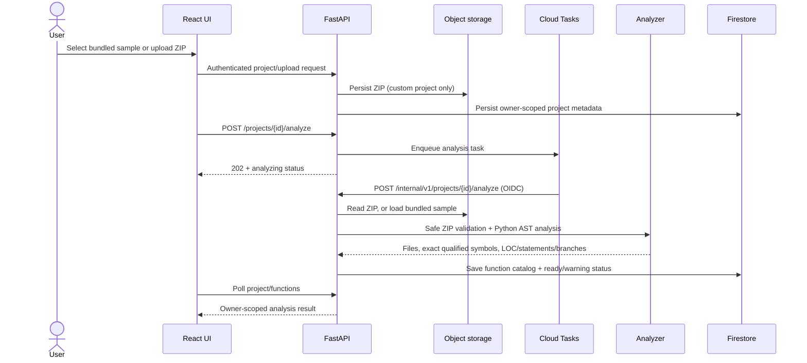

# PromptOpt architecture

Tài liệu này mô tả code và deployment hiện tại. Nguồn đối chiếu chính là `app/backend/services/container.py`, các router trong `app/backend/modules`, `app/frontend/src/app/providers.tsx`, `app/backend/modules/experiments/cloud_optimizer.py` và `cloud/run_job.py`.

## Component diagram



Không có vector store, RAG, LangGraph runtime hay relational database trong đường chạy này.

## Responsibility map

| Component | Trách nhiệm | Không chịu trách nhiệm |
| --- | --- | --- |
| React/Vite frontend | UI, Firebase login, API calls, polling run status, review action | Không chạy optimizer hoặc lưu secret |
| FastAPI | AuthN/AuthZ, validation, owner scoping, lifecycle state, signed/local object access, dispatch | Không thực hiện LLM search dài trong request công khai |
| Firestore | Project/function/experiment/run/prompt-version metadata và audit | Không lưu full optimizer workspace |
| GCS | Source ZIP, immutable dataset/prompt input, JSON/log/coverage/test artifacts | Không quyết định candidate nào được promote |
| Cloud Tasks | Tách request khỏi analysis/optimization dài; gọi internal endpoints bằng OIDC | Không chạy GEPA trực tiếp |
| GEPA Cloud Run Job | Tải immutable input, chạy CLI trên local disk, upload manifest/artifacts | Không nhận source ZIP từ web workflow; dùng bundled samples |
| CoverUp | Gọi model sinh/repair test và giữ structured attempt trace | Không chọn prompt winner |
| DSPy/GEPA optimizer | Search trên train/validation, cache evaluation, paired final holdout, strict promotion | Không được nhìn holdout để chọn candidate |
| pytest + SlipCover | Xác nhận test và đo statement/branch coverage theo exact `source_file + qualname` | Process exit code đơn lẻ không được tự xóa coverage đã xác nhận |

## Dataflow: project ingestion and analysis



Local mode replaces Firestore/GCS/Cloud Tasks with in-memory repositories, local files and inline dispatch. Bundled samples are read-only and reconstructed from `src/sample_repo`; they are not copied into project documents.

## Dataflow: prompt optimization and promotion

```mermaid
sequenceDiagram
    actor U as User
    participant A as FastAPI
    participant M as Firestore
    participant Q as Cloud Tasks
    participant G as GCS
    participant J as GEPA Cloud Run Job
    participant V as Vertex AI

    U->>A: Create experiment with targets, seed, split and settings
    A->>M: Save immutable experiment snapshot
    U->>A: POST /experiments/{id}/optimize
    A->>M: Save queued run; baseline digest is candidate 0
    A->>Q: Enqueue optimization task
    A-->>U: 202 + run id
    Q->>A: Execute internal optimization handler (OIDC)
    A->>G: Write dataset.jsonl + baseline prompt.json
    A->>J: Start job with opaque GCS prefix and model settings
    J->>G: Download immutable inputs
    loop GEPA search on train/validation
        J->>V: CoverUp generation / GEPA reflection
        J->>J: pytest + symbol coverage in isolated workspaces
    end
    J->>J: Paired baseline vs proposal on locked test split
    J->>G: Upload proposed/production prompt, final validation, traces, manifest
    Q->>A: Poll until manifest exists
    A->>G: Collect result and artifacts
    A->>M: Save scores, digests and comparison decision
    alt proposal strictly improves locked holdout
        A->>M: Create prompt version in_review
        U->>A: Approve or reject with comment
        A->>M: Save immutable review audit
    else tie, regression, invalid run, or same digest
        A->>M: Keep baseline; no promotable prompt version
    end
```

Điểm quan trọng:

- Baseline không chạy qua một “baseline service” riêng; nó là seed/candidate số 0 trong cùng protocol.
- Train/validation dùng cho search. Test split bị khóa và chỉ được dùng ở final promotion gate.
- `gepa_proposed.json` giữ proposal để chẩn đoán; `gepa_optimized.json` giữ quyết định production và có thể chính là baseline.
- Nếu proposal digest bằng baseline, final split được skip. Nếu khác, candidate phải **strictly better** trên paired holdout mới đủ điều kiện review.
- Full workspace chạy trên local disk của Job vì coverage database cần random-access writes; chỉ artifact hoàn chỉnh mới upload lên GCS.

## Runtime profiles

| Concern | Local-safe profile | Production profile |
| --- | --- | --- |
| User auth | `disabled`, bearer `dev-token` | Firebase ID token |
| Metadata | In-memory repositories | Firestore |
| Objects | `app/data/uploads` | Private GCS bucket |
| Analysis | Inline | Cloud Tasks -> internal API |
| Optimization dispatch | Inline API wiring, cloud optimizer disabled | Cloud Tasks -> internal API -> Cloud Run Job |
| Frontend delivery | Vite dev server | Firebase Hosting |
| `/api` routing | Vite proxy to `127.0.0.1:8000` | Firebase Hosting rewrite to Cloud Run API |

## Trust boundaries

- Public business endpoints require a bearer token; production verifies Firebase ID tokens.
- Internal task endpoints use a Google-signed OIDC token with configured audience and service account.
- All repository reads/writes are owner-scoped; GCS object names use owner/project/experiment/run identity or an opaque runner prefix.
- Production validation refuses memory/local/inline backends and requires Firebase, Firestore, GCS, Cloud Tasks and Cloud Run Job configuration.
- ZIP analysis enforces file-count, uncompressed-size and path-safety limits.
- Model credentials remain in Cloud runtime/ADC; the browser never receives them.
