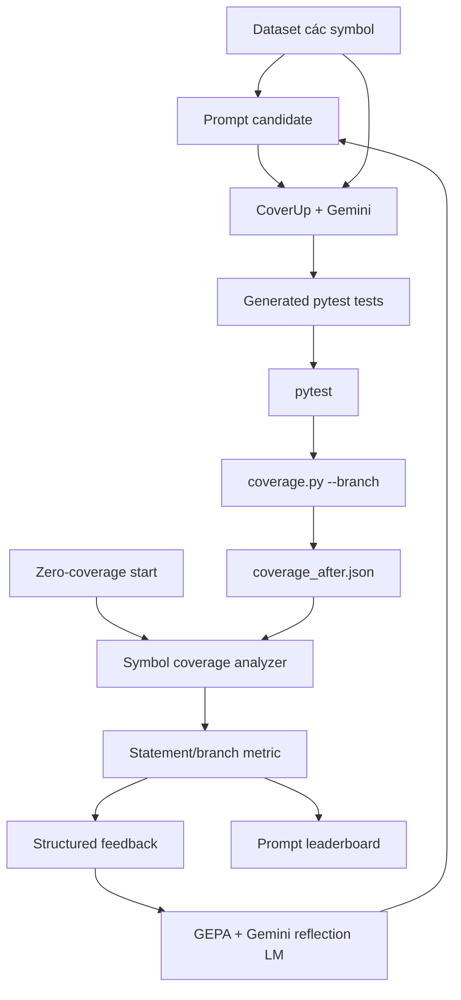

# Tối ưu prompt sinh unit test cho CoverUp

Pipeline này dùng CoverUp làm engine sinh và sửa unit test, `coverage.py` làm bộ
đánh giá deterministic, và DSPy GEPA dùng Gemini để tìm prompt tốt hơn. Mục tiêu
hiện tại là tối đa hóa statement coverage và branch coverage trên từng hàm Python.

## Tổng quan kiến trúc



Các trách nhiệm được tách như sau:

- CoverUp đọc source, xác định phần coverage còn thiếu, gọi Gemini và sửa test qua
  nhiều attempt.
- `coverage.py` chạy test suite trước và sau khi sinh test, sau đó xuất JSON có
  coverage theo file và function.
- Symbol analyzer chỉ lấy coverage của hàm đang đánh giá, không dùng phần trăm
  coverage toàn repository làm reward.
- Metric và hard gate được tính bằng code, không dùng LLM judge.
- GEPA nhận score cùng feedback về line/branch còn thiếu để cải thiện prompt.

## Thành phần mã nguồn

```text
src/optimization/
├── archive.py      # Greedy candidate test archive, khóa theo split/digest
├── calibration.py  # Báo cáo repeated calibration và coverage-unit oracle
├── cli.py          # CLI init, evaluate, optimize, rerank, finalize và archive
├── combined_suite.py # Chạy lại suite ghép để xác minh coverage thật
├── coveragepy.py   # Chạy coverage.py và đọc coverage từng symbol
├── dataset.py      # Đọc dataset JSONL
├── gepa.py         # Direct PromptBundle adapter và GEPA core optimizer
├── metrics.py      # Coverage gain, score và feedback
├── models.py       # SymbolTarget, ExperimentConfig và RunRecord
├── prompts.py      # PromptBundle và baseline prompt
└── runner.py       # Một experiment CoverUp cô lập hoàn chỉnh
```

CoverUp được mở rộng bằng option:

```text
--prompt-template-file <prompt.json>
```

Option này chỉ áp dụng cho prompt family `gpt-v2`. File JSON override hai
template:

```json
{
  "initial": "...",
  "error": "..."
}
```

Hai template đều bắt buộc đối với `evaluate` và `optimize`. Pipeline tối ưu vòng
hội thoại sinh test lần đầu và sửa lỗi pytest.
Candidate thiếu một template hoặc placeholder bắt buộc sẽ nhận score 0 trước khi
CoverUp được gọi.

## Chuẩn bị môi trường

Từ thư mục gốc repository:

```powershell
$env:PYTHONPATH = "src"
```

Các dependency chính:

```text
coverage>=7.15.2
dspy==3.2.1
gepa==0.0.27
litellm[google]>=1.94.0
```

Gemini được cấu hình giống CoverUp qua `.env`:

```dotenv
COVERUP_MODEL=vertex_ai/gemini-3.6-flash
OPTIMIZE_MODEL=vertex_ai/gemini-3.6-flash
VERTEXAI_PROJECT=<google-cloud-project>
VERTEXAI_LOCATION=global
```

`COVERUP_MODEL` sinh và sửa unit test. `OPTIMIZE_MODEL` đọc score/feedback và
reflection để đề xuất hai prompt template mới. Hai biến có thể trỏ tới hai model
khác nhau. Optimization CLI chỉ đọc hai model từ `.env` và không nhận model qua
command line, nhờ đó mỗi run có một nguồn cấu hình duy nhất.

Vertex AI dùng Application Default Credentials. Cần đăng nhập ADC trước khi chạy
evaluate hoặc optimize có gọi LLM.

Source isort hiện nằm tại:

```text
src/sample_repo/isort/isort
```

Test suite nằm tại:

```text
src/sample_repo/isort/tests
```

## Khởi tạo prompt và dataset

```powershell
python -m src.optimization.cli init
```

Lệnh tạo:

```text
eval/prompt_optimization/
├── datasets/isort_mlxtend_symbols.jsonl
└── prompts/gpt_v2_baseline.json
```

Nếu file đã tồn tại, CLI sẽ dừng để tránh ghi đè. Muốn tạo lại:

```powershell
python -m src.optimization.cli init --force
```

## Dataset symbol

Mỗi dòng trong `datasets/isort_mlxtend_symbols.jsonl` là một JSON object:

```json
{"project":"isort","source_file":"isort/core.py","symbol":"process","split":"train"}
```

Các trường:

| Trường | Ý nghĩa |
|---|---|
| `project` | Tên project dùng trong run ID và artifact |
| `source_file` | Đường dẫn file như xuất hiện hoặc là suffix duy nhất trong coverage JSON |
| `symbol` | Tên function hoặc qualified method, ví dụ `process`, `Config.__init__` |
| `split` | `train`, `validation` hoặc `test` |

Khuyến nghị không đưa cùng một symbol vào nhiều split. `test` là locked split,
chỉ nên chạy sau khi đã chọn prompt bằng validation.

Dataset mới do `init` tạo có 50 train, 30 validation và 30 locked-test symbols. Train
lớn hơn giúp reflection thấy nhiều failure mode; validation nhỏ hơn dành budget cho
exploration; test chỉ được dùng một lần ở promotion gate. Dataset cũ không có split
`test` vẫn chạy được nhưng final comparison phải fallback về validation.

Generator của dataset isort loại `isort/_vendored/`. Vendored code thường bị coverage
config bỏ qua và import path có thể đổi theo Python version; đưa nó vào validation làm
metric mất denominator và có thể tạo score 0 giả.

Project stratification is mandatory for the main optimization flow. Rebuild the
ranked dataset with `python scripts/build_ranked_dataset.py`; the builder keeps
the exact global split limits, allocates every project proportionally to all
three splits, and interleaves per-project ranks to keep difficulty comparable.
`optimize` and `finalize` reject custom datasets whose project distributions
are missing or materially skewed across splits.

## Prompt baseline

Prompt `gpt_v2_baseline.json` chứa hai template với placeholder bắt buộc:

```text
initial:            {filename}, {coverage_targets}, {source_excerpt}
error:              {error}
```

Các placeholder của initial prompt là:

```text
{filename}
{coverage_targets}
{source_excerpt}
```

Trước khi chạy CoverUp, pipeline thay chúng bằng:

- đường dẫn source file;
- line và branch chưa được thực thi;
- code excerpt của function/class đang xử lý.

Candidate thiếu placeholder hoặc có placeholder không hợp lệ nhận score 0 và không
được chạy CoverUp.

## Luồng của một experiment

Một lần gọi `CoverUpExperimentRunner.evaluate_batch()` thực hiện các bước sau.

### 1. Tạo run cô lập

Pipeline tạo run ID dạng:

```text
isort-train-batch-a1b2c3d4
```

Mỗi batch/project của một candidate có một workspace test rỗng dùng chung dưới thư mục
`<artifacts-dir>/generated_tests/<split>/`:

```text
<artifacts-dir>/generated_tests/train/tests_candidate_<candidate-id>
<artifacts-dir>/generated_tests/validation/tests_base_line_<baseline-digest>
<artifacts-dir>/generated_tests/validation/tests_candidate_<candidate-id>
```

Baseline prompt dùng prefix `tests_base_line_` để phân biệt với các candidate do GEPA
đề xuất. ID workspace chứa cả định danh target, nên các target có thể được đánh giá
song song mà không ghi đè lẫn nhau. CoverUp chỉ sinh test cho target đang được đánh
giá. Train và validation không dùng chung test; không sao chép test suite gốc.

### 2. Khởi tạo coverage

Mỗi candidate bắt đầu từ coverage 0. Pipeline không chạy pytest trên folder rỗng và
không tạo `coverage_before.json`; coverage-before được biểu diễn nội bộ với toàn bộ line
và branch của target ở trạng thái chưa được thực thi.

### 3. Chạy CoverUp cho nhiều symbol

Runner gọi:

```powershell
python -m coverup `
  --package-dir src/sample_repo/isort/isort `
  --tests-dir <shared-batch-tests> `
  --target-symbols process,Trie.search,Config.is_supported_filetype,grid `
  --prompt gpt-v2 `
  --prompt-template-file <run-dir>/prompt.json `
  --model vertex_ai/gemini-3.6-flash `
  --max-attempts 3 `
  --max-concurrency 10 `
  --prefix opt `
  --repeat-tests 5 `
  --no-checkpoint
```

Luồng nội bộ của CoverUp:

1. Đọc coverage hiện có bằng execution engine của CoverUp.
2. Tạo `CodeSegment` chứa excerpt, missing lines và missing branches.
3. Render initial prompt candidate.
4. Gọi Gemini sinh một pytest module hoàn chỉnh.
5. Chạy candidate test tạm.
6. Nếu pytest fail, gửi traceback qua error repair prompt.
7. Nếu test pass nhưng không tăng coverage, ghi trace `no_coverage_gain_unrepairable` và dừng target.
8. Khi candidate có coverage gain, lưu thành `test_opt_<n>.py` trong test suite cô lập.

Nếu provider trả `finish_reason="stop"` nhưng `content=null`, hoặc trả text không có
Python code block, CoverUp ghi log và retry riêng segment đó trong giới hạn
`--max-attempts`. Một response hỏng không được làm hủy các task concurrent còn lại.

### 4. Đo coverage sau generation

Runner chạy lại toàn bộ test suite của split bằng `coverage.py --branch` đúng một lần và xuất:

```text
coverage_after.json
```

Nếu generated suite fail dưới coverage.py, candidate nhận score 0.

### 5. Lấy coverage của đúng function

Parser tìm:

```text
files → <source_file> → functions → <symbol>
```

Các dữ liệu được sử dụng:

```text
executed_lines
missing_lines
executed_branches
missing_branches
summary.covered_lines
summary.num_statements
summary.covered_branches
summary.num_branches
```

Đường dẫn Windows và POSIX được chuẩn hóa trước khi lookup. `source_file` trong
dataset cũng có thể là suffix duy nhất như `isort/parse.py`.

### 6. Tính metric

Reward dùng coverage gain trên những target còn thiếu trước khi sinh test:

```text
statement_gain = newly_covered_missing_lines / initially_missing_lines
branch_gain    = newly_covered_missing_branches / initially_missing_branches

score = 0.4 × statement_gain + 0.6 × branch_gain
```

Nếu hàm không có branch:

```text
score = statement_gain
```

Hard gate đưa target về 0 khi:

- generated test suite fail khi chạy coverage.py;
- coverage.py không xuất được report;
- coverage không tìm thấy target;
- candidate prompt không giữ placeholder bắt buộc.

Exit code khác 0 của tiến trình CoverUp được lưu thành `generator_exit_code`, nhưng
không xóa coverage của những test đã sinh thành công. Nếu suite cuối cùng pass
coverage.py thì score đo được của target vẫn hợp lệ; feedback kèm warning để điều tra
các sibling target chưa hoàn tất.

### 7. Tạo feedback

Feedback trả cho GEPA có dạng:

```text
Score: 0.6250
Statement gain: 8 newly covered; 3 remain.
Branch gain: 4 newly covered; 5 remain.
Remaining lines: [42, 47, 51]
Remaining branches: [(41, 42), (46, 47), ...]
Target each remaining branch with a distinct input and a meaningful assertion.
```

Pytest stdout và CoverUp log vẫn được lưu riêng để phân tích traceback, LLM request,
response và token usage.

## Chạy đánh giá một prompt

Đánh giá baseline trên validation split:

```powershell
$env:PYTHONPATH = "src"

python -m src.optimization.cli `
  --sample-repos-dir src/sample_repo `
  evaluate `
  --dataset eval/prompt_optimization/datasets/isort_mlxtend_symbols.jsonl `
  --prompt eval/prompt_optimization/prompts/gpt_v2_baseline.json `
  --split validation
```

Kết quả console gồm các run ID và micro-average score có tính cả target thất bại.
Statement và branch được cộng theo số executable units; target lookup thất bại dùng
denominator của baseline và nhận coverage 0. Chi tiết từng run nằm trong `runs/`.

Có thể đánh giá train hoặc locked test bằng cách đổi `--split`.

## Chạy GEPA

```powershell
$env:PYTHONPATH = "src"

python -m src.optimization.cli `
  --sample-repos-dir src/sample_repo `
  optimize `
  --dataset eval/prompt_optimization/datasets/isort_mlxtend_symbols.jsonl `
  --prompt eval/prompt_optimization/prompts/gpt_v2_baseline.json
```

Mặc định CLI dùng `--auto medium`. Có thể chọn budget tự động khác:

```powershell
python -m src.optimization.cli `
  --sample-repos-dir src/sample_repo `
  optimize `
  --dataset eval/prompt_optimization/datasets/isort_mlxtend_symbols.jsonl `
  --prompt eval/prompt_optimization/prompts/gpt_v2_baseline.json `
  --auto light
```

Hoặc tắt auto bằng budget thủ công:

```powershell
$env:PYTHONPATH = "src"

python -m src.optimization.cli `
  --sample-repos-dir src/sample_repo `
  optimize `
  --dataset eval/prompt_optimization/datasets/isort_mlxtend_symbols.jsonl `
  --prompt eval/prompt_optimization/prompts/gpt_v2_baseline.json `
  --max-metric-calls 20
```

GEPA tối ưu trực tiếp hai text component `initial` và `error`. Không còn component repair
coverage hoặc một LLM trung gian viết lại cả bundle trước khi optimization bắt đầu. Baseline
chính là candidate số 0 và luôn nằm trong Pareto population.

Trước khi GEPA bắt đầu search, pipeline chạy baseline preflight trên toàn train và
validation split. Final holdout reference cũng được kiểm tra trước promotion. Mọi target
phải có coverage hợp lệ để cung cấp denominator. Nếu một target bị thiếu hoặc invalid,
pipeline dừng trước khi tiêu search budget và liệt kê chính xác `file::symbol` cần
sửa/thay thế.

Trong mỗi vòng reflection:

1. Khi có failure evidence, GEPA chuyển cả `initial` và `error` cho reflection LM với
   minibatch 8. Trong đúng một native `update_prompt_component` tool call, LM chọn `initial`, `error`, hoặc
   `all` và trả luôn complete replacement. `all` luôn được phép, kể cả khi direct evidence
   chỉ có ở một stage; update này chỉ được áp dụng khi cả hai replacement hợp lệ và thực sự đổi.
2. Cả bundle được validate và hash để tạo candidate ID ổn định.
3. Mỗi batch dùng một generated-tests workspace chung theo project; test của từng symbol
   được chọn chính xác bằng `source_file + qualname`. Sau generation, coverage/pytest của
   các target chạy trong bounded thread pool theo `min(max_concurrency, CPU count)`, với
   coverage data, pytest basetemp và cache cô lập cho từng target.
4. Mỗi example nhận score riêng của symbol, được scale theo số statement/branch để mean
   của GEPA đúng bằng micro-average cuối cùng.
5. Feedback chứa file, symbol, source lines liên quan, coverage còn thiếu và kết quả từng
   replicate. Structured trace tái dựng episode đầy đủ `initial test -> error -> repaired test
   -> outcome`, giữ traceback và coverage gain/remaining nhưng không lặp baseline test trong
   mỗi record. Reflection LM dùng toàn bộ episode để tự attribution component.
6. Function call trả diagnosis, evidence và replacement trong cùng một model response. Proposal
   phải giữ placeholder và giới hạn độ dài. Decision được ghi tại
   `candidates/reflection_decisions.jsonl`; update `all` được validate nguyên tử.

Kết quả metric được cache theo `prompt hash + split` tại
`candidates/evaluations/<candidate-id>/<evaluation-digest>/<split>/batch.json`.
`evaluation-digest` bao gồm model/config, target set, source hashes và hash cây test Python nên cache cũ không
thể âm thầm được dùng sau khi code hoặc protocol thay đổi. Các replicate bổ sung dùng
`batch_r1.json`, `batch_r2.json`, ... và workspace riêng theo batch. CoverUp sinh cả batch
trong một process; sau đó pipeline dùng `trace.saved_test` để chạy pytest/coverage chỉ trên
test file của từng `source_file + qualname`, nên GEPA vẫn nhận đúng score và feedback theo
symbol. Cache per-example nội bộ của GEPA được tắt để ID integer của train
không thể va chạm với validation; cache artifact phía adapter vẫn được giữ nguyên.

Target-specific generation mặc định bổ sung exact API contract trong ngân sách 6.000 ký tự. Có thể tắt bằng `--no-target-context`. Existing test/fixture retrieval là ablation riêng và mặc định tắt; chỉ bật bằng `--repository-test-context`. Khi bật, test context được đọc từ repository gốc qua `--context-tests-dir`; generated test vẫn được ghi và chạy trong workspace cô lập qua `--tests-dir`, vì vậy context không làm nhiễm suite đánh giá.

Batch generation, per-target test-file scoring, deterministic Python hash ordering và target/repository context hiện dùng cache schema 17. Artifact từ schema cũ không được tái sử
dụng; với benchmark quyết định vẫn nên chọn một `--artifacts-dir` mới.

Sau khi compile xong, pipeline lưu:

```text
eval/prompt_optimization/optimized_program.json
eval/prompt_optimization/candidate_rerank.json
eval/prompt_optimization/prompts/gepa_proposed.json
eval/prompt_optimization/prompts/gepa_reranked.json
eval/prompt_optimization/prompts/gepa_optimized.json
eval/prompt_optimization/final_validation.json
```

Prompt mới được lưu trước dưới tên `gepa_proposed.json`. Nếu GEPA chọn lại đúng baseline,
pipeline giữ baseline trong `gepa_optimized.json` và bỏ toàn bộ final test/holdout vì không
có prompt mới để so sánh; `final_validation.json` ghi `final_evaluation_skipped=true`. Nếu
proposal khác baseline, baseline và proposal được so sánh trên locked test; nếu không có
test thì fallback về validation. Proposal chỉ được promote khi cải thiện nghiêm ngặt, nên
một proposal hòa hoặc kém không thể thay thế baseline.

Để giảm việc chọn nhầm một lucky validation sample, có thể bật E26 ngay trong `optimize`:

```powershell
python -m src.optimization.cli `
  --sample-repos-dir src/sample_repo `
  --artifacts-dir <run-dir> `
  optimize `
  --dataset <dataset.jsonl> `
  --prompt <baseline.json> `
  --max-metric-calls 30 `
  --rerank-top-k 5 `
  --rerank-replicates 3
```

Top-K tính cả baseline bắt buộc. Reranker chỉ dùng validation, chọn theo mean coverage,
failure rate, variance và cuối cùng là độ dài prompt; chỉ winner mới đi tiếp tới final
holdout. Mặc định `--rerank-top-k 0` để các workflow hiện tại không tự tăng chi phí.

Nếu GEPA search đã chạy xong, có thể rerank trực tiếp `optimized_program.json` mà không
chạy lại search:

```powershell
python -m src.optimization.cli `
  --sample-repos-dir src/sample_repo `
  --artifacts-dir <run-dir> `
  rerank `
  --dataset <dataset.jsonl> `
  --prompt <baseline.json> `
  --optimized-program <run-dir>/optimized_program.json `
  --top-k 5 `
  --replicates 3
```

Lệnh này ghi `candidate_rerank.json` và `prompts/gepa_reranked.json`; cache r0 được tái
sử dụng, chỉ các replicate còn thiếu mới gọi model. Sau đó dùng prompt đã chọn làm
`--proposed-prompt` cho `finalize`.

`finalize --evaluation-replicates N` lặp cả baseline lẫn proposal với cùng `N`; r0 hợp lệ được
tái sử dụng từ cache và chỉ sinh các replicate còn thiếu. Kết quả final là mean-to-mean paired theo
cùng target/protocol, không so candidate nhiều lần với một baseline reference duy nhất.

Sơ đồ ASCII chi tiết về input, batch/example, cache, reflection và promotion nằm tại
`docs/GEPA_CURRENT_FLOW.md`.

Nếu đã có test suite baseline hợp lệ, `--baseline-tests-dir <path>` chấm suite đó như một
reference bổ sung trong report. Promotion gate vẫn dùng baseline/proposal được sinh theo
cùng protocol để tránh so sánh một historical lucky sample với một generation mới.

`--auto light|medium|heavy` tương ứng budget 120/300/600 prompt-symbol calls. Dùng
`--max-metric-calls` để override. Có thể thêm `--evaluation-replicates 2` hoặc `3` cho
run quyết định; mỗi replicate làm tăng gần tuyến tính chi phí nhưng giảm variance.

## Artifact của từng run

```text
runs/<candidate-id>/<split>/<run-id>/
├── prompt.json
├── coverup.log
├── coverup.stdout.log
├── attempt_trace.jsonl
├── coverage_after.json
├── coverage_after.data
├── record.json
```

Mỗi prompt candidate có một `<candidate-id>` riêng (digest của toàn bộ prompt bundle).
Runner gom workspace độc lập vào
`<artifacts-dir>/generated_tests/<split>/tests_candidate_<candidate-id>`; riêng baseline
dùng prefix `tests_base_line_`. Source test suite `tests/` không chứa generated workspace
nên một lần chạy pytest thông thường không vô tình thu thập test của benchmark.

`record.json` là structured summary chính:

```json
{
  "run_id": "isort-train-batch-a1b2c3d4",
  "split": "train",
  "targets": [
    {"project": "isort", "source_file": "isort/core.py", "symbol": "process", "split": "train"},
    {"project": "isort", "source_file": "isort/utils.py", "symbol": "Trie.search", "split": "train"}
  ],
  "exit_code": 0,
  "elapsed_seconds": 12.4,
  "generated_tests": ["work/tests/test_opt_1.py"],
  "coverage_after": "coverage_after.json",
  "results": [
    {"target": {"symbol": "process"}, "score": {"score": 0.7}, "feedback": "..."},
    {"target": {"symbol": "Trie.search"}, "score": {"score": 0.5}, "feedback": "..."}
  ]
}
```

Các thư mục run, GEPA log và candidate được `.gitignore` vì có thể rất lớn.

## Kiểm tra không gọi LLM

Kiểm tra wiring CoverUp, target symbol và prompt template mà không gọi Gemini:

```powershell
$env:PYTHONPATH = "src"

python -m coverup `
  --package-dir src/sample_repo/isort/isort `
  --tests-dir src/sample_repo/isort/tests `
  --target-symbols process `
  --prompt gpt-v2 `
  --prompt-template-file eval/prompt_optimization/prompts/gpt_v2_baseline.json `
  --model vertex_ai/gemini-3.6-flash `
  --dry-run `
  --no-repeat-tests `
  --no-checkpoint
```

## Kiểm thử code

```powershell
python -m pytest tests -q
ruff check src/optimization tests/test_coverage_optimization.py
```

Không nên chạy `pytest` không chỉ định thư mục ở root hiện tại vì pytest sẽ thu thập
cả test suite vendored trong `src/sample_repo/mlxtend`, gây trùng tên module test.

## Candidate test archive không gọi LLM

Archive chỉ đọc cached candidate evaluations có cùng `evaluation_digest` và cùng split. Nó content-deduplicate test, dùng greedy weighted set-cover, sau đó chạy lại toàn bộ suite với repeat verification:

```powershell
python -m src.optimization.cli `
  --sample-repos-dir src/sample_repo `
  --artifacts-dir binh/phase0_runs/calibration16_gemini35_flash_lite_r2 `
  --repeat-tests 5 `
  archive `
  --split validation `
  --output-dir binh/phase1_candidate_archive_r5
```

Không dùng archive score làm score của một prompt GEPA. `test` bị khóa mặc định; chỉ dùng `--allow-holdout` cho báo cáo cuối một lần, không dùng để chọn/tune archive.

## Lưu ý vận hành

- Một lượt `evaluate` có gọi Gemini và phát sinh chi phí.
- Một lượt GEPA gọi CoverUp và coverage.py nhiều lần; chi phí tăng theo
  `max-metric-calls`, số symbol và số repair attempt.
- Giữ CoverUp generation temperature bằng 0 để giảm variance, nhưng để reflection
  temperature khoảng `0.7` nhằm duy trì exploration giữa các mutation.
- Mặc định giới hạn `--max-concurrency 10`; giảm thêm hoặc đặt `--rate-limit` nếu log có
  lỗi 429. Không dùng mặc định CoverUp 50 cho một batch optimization lớn.
- Không chỉnh test suite gốc trong lúc một experiment đang chạy.
- Không chọn prompt theo train score. Chọn bằng validation rồi báo cáo đúng một lần
  trên locked test split.
- Coverage cao không tự đảm bảo assertion tốt. Pipeline hiện tối ưu đúng hai metric
  được yêu cầu: statement và branch coverage.
- `gemini-3.6-flash` là model mới; CoverUp cho phép họ `vertex_ai/gemini-*` đi qua
  local capability check và để Vertex API xác nhận function calling thực tế.

## Hướng mở rộng

Các bước tiếp theo hợp lý:

1. Mở rộng dataset lên nhiều function/class và cân bằng độ khó giữa các split.
2. Cache baseline coverage theo hash của source và test suite để giảm thời gian.
3. Parse token usage từ `coverup.log` thành trường riêng trong `record.json`.
4. Thêm failure taxonomy: syntax, import, assertion, timeout và no-gain.
5. Sau khi joint optimization ổn định, chạy thêm ablation để đo đóng góp riêng của
   `initial` và `error`.
6. Thêm MIPROv2 sau khi đã có demonstration bank đủ lớn từ các run thành công.

## Lệnh benchmark chất lượng cao

```powershell
python -m src.optimization.cli `
  --sample-repos-dir src/sample_repo `
  --artifacts-dir eval/prompt_optimization_v3 `
  --max-concurrency 10 `
  --repeat-tests 5 `
  optimize `
  --dataset eval/prompt_optimization/datasets/isort_mlxtend_symbols.jsonl `
  --prompt eval/prompt_optimization/prompts/gpt_v2_baseline.json `
  --auto heavy `
  --evaluation-replicates 2 `
  --reflection-temperature 0.7
```

python -m src.optimization.cli `
  --sample-repos-dir src/sample_repo `
  --artifacts-dir eval/prompt_optimization_batch_v2 `
  optimize `
  --dataset eval/prompt_optimization/datasets/isort_mlxtend_symbols.jsonl `
  --prompt eval/prompt_optimization/prompts/gpt_v2_baseline.json `
  --max-metric-calls 50


## Không được xóa
  python -m src.optimization.cli `
    --artifacts-dir eval/prompt_optimization_v3 `
    --max-concurrency 10 `
    optimize `
    --dataset eval/prompt_optimization/datasets/isort_mlxtend_symbols.jsonl `
    --prompt eval/prompt_optimization/prompts/gpt_v2_baseline.json `
    --max-metric-calls 450
