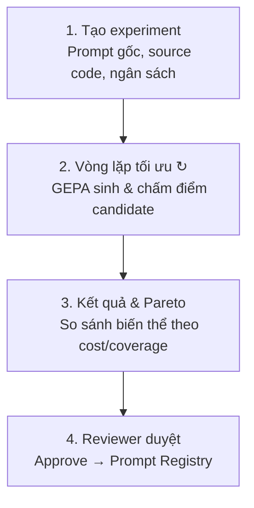
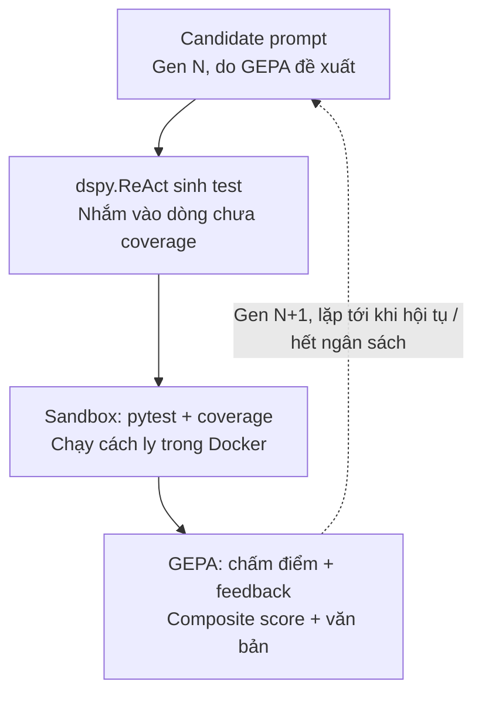

# Agent tối ưu Prompt cho tác vụ sinh Unit Test — Tài liệu kỹ thuật

## Mục lục

1. [Tổng quan & ý tưởng](#1-tổng-quan--ý-tưởng)
2. [Phạm vi & đóng góp](#2-phạm-vi--đóng-góp)
3. [Tech stack](#3-tech-stack)
4. [Kiến trúc & luồng hoạt động](#4-kiến-trúc--luồng-hoạt-động)
5. [Kế hoạch 6 tuần](#5-kế-hoạch-6-tuần)
   - [Lộ trình phiên bản: v0 → bản tốt nhất](#lộ-trình-phiên-bản-v0--bản-tốt-nhất)
   - [Mở rộng nếu không giới hạn thời gian](#mở-rộng-nếu-không-giới-hạn-thời-gian)
6. [Hướng dẫn xây dựng chi tiết](#6-hướng-dẫn-xây-dựng-chi-tiết)
   - [Chia module để làm việc song song](#chia-module-để-làm-việc-song-song)
   - [6.11 Đa mục tiêu thật (v+1)](#611-đa-mục-tiêu-thật-v1)
   - [6.12 Memory / warm-start (v+2)](#612-memory--warm-start-giữa-các-lần-chạy-v2)
   - [6.13 Production-grade (v+3)](#613-production-grade-v3)
7. [Đánh giá cuối kỳ](#7-đánh-giá-cuối-kỳ)
   - [Baseline nào cần có](#baseline-nào-cần-có)
   - [So sánh những gì](#so-sánh-những-gì)
8. [Phụ lục: Glossary](#8-phụ-lục-glossary)
9. [Phụ lục: Tài liệu tham khảo](#9-phụ-lục-tài-liệu-tham-khảo)

---

## 1. Tổng quan & ý tưởng

### Thực trạng

Tinh chỉnh prompt thủ công để đạt chất lượng cao hiện nay tốn thời gian, phụ thuộc cảm tính của người viết, khó tái lập giữa các đội, và khó cân bằng giữa chất lượng — chi phí — độ trễ.

### Vấn đề đã thu hẹp

Thay vì xây một agent tối ưu prompt cho **tác vụ bất kỳ**, đề tài thu hẹp vào một tác vụ cụ thể: **sinh unit test cho code Python**. Đây là lựa chọn có chủ đích vì:

- Evaluation có thể **khách quan/thực thi được** (build được, pass được, coverage, mutation score) thay vì phải dựa vào LLM-as-judge chủ quan.
- Có sẵn benchmark, baseline công nghiệp, và một dòng nghiên cứu học thuật để đối chiếu (xem mục 9).
- Có một khoảng trống thật: chưa có hệ thống nào áp dụng đúng vòng lặp tối ưu prompt tự động (kiểu APE/DSPy/GEPA) cho riêng test generation với fitness function thực thi được — các hệ thống hiện có hoặc dùng prompt tĩnh do người thiết kế (CoverUp, SymPrompt) hoặc fine-tune bằng RL (TestCTRL), không phải search có hệ thống trên không gian prompt.

---

## 2. Phạm vi & đóng góp

**Câu chuyện đóng góp:** áp dụng và đánh giá một khung tối ưu prompt tự động (DSPy/GEPA) cho bài toán sinh unit test, dùng fitness function hoàn toàn dựa trên thực thi (build/pass/coverage/mutation score) thay vì LLM-as-judge hay fine-tune RL như các công trình trước, so sánh với baseline tĩnh và số liệu triển khai thực tế đã công bố.

**Trong phạm vi 6 tuần (MVP):**
- Vòng lặp tối ưu hoàn chỉnh (đây là phần thể hiện đóng góp, đầu tư nhiều nhất).
- Đa mục tiêu tối giản: 2 trục (mutation score vs cost), 1 chart tĩnh — không cần Pareto UI tương tác đầy đủ.
- HITL tối giản: 1 nút Approve + log, không cần multi-role/auth đầy đủ.
- Early stopping: dùng ngân sách có sẵn của GEPA (`auto="light"`), không cần tự viết thuật toán racing riêng.

**Cắt khỏi phạm vi 6 tuần:** memory/tái sử dụng chiến lược giữa các lần chạy, multi-role auth đầy đủ, cost dashboard có cảnh báo thời gian thực.

**Một điều chỉnh quan trọng so với ý tưởng ban đầu:** không gọi CoverUp như một hộp đen và "cắm" prompt tối ưu vào nó — CoverUp là CLI tool với prompt nằm cứng trong mã nguồn, không phải tham số truyền từ ngoài. Thay vào đó, tự cài lại đúng ý tưởng coverage-guided của CoverUp bằng một `dspy.ReAct` module tự viết, để DSPy/GEPA có toàn quyền tối ưu prompt bên trong.

---

## 3. Tech stack

| Thành phần | Công nghệ | Vai trò |
|---|---|---|
| Optimizer | DSPy (GEPA, BootstrapFewShot) | Sinh & chọn biến thể prompt |
| Test-gen module | `dspy.ReAct` (tự viết) | Sinh unit test, nhắm vào phần chưa coverage |
| Harness | pytest, coverage.py, mutmut | Đo build/pass/coverage/mutation, chạy trong Docker |
| Orchestration | LangGraph | Điều phối luồng experiment (không tái hiện lại vòng lặp nội bộ của GEPA) |
| LLM gateway | LiteLLM | Chuẩn hoá lời gọi nhiều provider |
| Observability | Langfuse | Trace token/cost/latency mọi lệnh gọi LLM |
| Backend | FastAPI, SQLAlchemy, Alembic, PostgreSQL | API, ORM, migration, lưu trữ |
| Frontend | Next.js | Playground, Optimization Run, Pareto chart, Review |
| Triển khai | Docker / docker-compose | Container hoá backend, frontend, sandbox chạy test |

---

## 4. Kiến trúc & luồng hoạt động



Chi tiết bên trong giai đoạn 2 — vòng lặp tối ưu:



**Lưu ý quan trọng:** vòng lặp trong sơ đồ trên nằm **bên trong** một lệnh gọi `gepa.compile(...)` duy nhất — GEPA tự quản lý việc sinh, chấm điểm, và dừng theo ngân sách. LangGraph **không** cần tái hiện lại từng generation thành các node riêng; LangGraph chỉ điều phối ở tầng thô hơn: khởi tạo → gọi GEPA (1 node) → lưu kết quả → (một luồng khác) chờ review. Đây là điểm nhiều người mới dùng DSPy hay nhầm.

---

## 5. Kế hoạch 6 tuần

| Tuần | Việc chính |
|---|---|
| 1 | Chọn 20-40 hàm Python làm eval set. Dựng harness (mục 6.1) — rủi ro cao nhất, làm trước, làm chắc. |
| 2 | Viết `GenerateUnitTest` signature + `TestGenReactModule` (mục 6.2). Chạy thử với `BootstrapFewShot` + `simple_metric` để xác nhận pipeline thông suốt. |
| 3 | Chuyển sang `gepa_metric` + `dspy.GEPA` (mục 6.3, 6.4). Log qua Langfuse. So với baseline. |
| 4 | Thêm Pareto tối giản (mục 6.6), backend API (6.5), HITL 1 nút (6.8), frontend tối thiểu (6.9). |
| 5 | Chạy trên held-out test set (mục 7). Viết báo cáo. |
| 6 | Đệm, hoàn thiện demo. |

### Lộ trình phiên bản: v0 → bản tốt nhất

Bảng tuần ở trên là lịch theo thời gian; bảng dưới đây là lịch theo **năng lực** — mỗi mốc là một bản chạy được thật, để nhóm luôn có thứ demo/nộp được ngay cả khi thời gian bị cắt ngắn giữa chừng. Nguyên tắc: "luôn có bản chạy được" quan trọng hơn cố hoàn thành mọi thứ cùng lúc.

| Phiên bản | Có gì | Chưa có gì | Tương ứng |
|---|---|---|---|
| **v0 — Walking skeleton** | 1 hàm mẫu, 1 prompt cố định (chưa tối ưu), chạy qua harness, in ra build/pass/coverage | optimizer, DB, UI, mutation score | Đầu Tuần 1 |
| **v1 — Optimizer đơn giản** | `dspy.ReAct` + `BootstrapFewShot` + `simple_metric`, chạy trên 5–10 hàm, vẫn command-line | GEPA, mutation score, backend/API, Pareto | Cuối Tuần 2 |
| **v2 — Optimizer thật** | Chuyển sang `GEPA` + `gepa_metric` (feedback text), chạy đủ 20–40 hàm (train/val/holdout tách riêng), mutation score bật lên, log Langfuse, so với baseline | backend/API/DB, UI, Pareto, HITL | Cuối Tuần 3 |
| **v3 — Sản phẩm dùng được** | + backend API/DB, Pareto tối giản (1 chart tĩnh), HITL 1 nút Approve, frontend tối thiểu | multi-role auth thật, cost dashboard, memory | Cuối Tuần 4 |
| **v-final (giới hạn 6 tuần)** | + đánh giá trên held-out set (mục 7), báo cáo so sánh baseline/kỹ thuật tĩnh/GEPA | memory, multi-role auth đầy đủ, cost dashboard cảnh báo — nêu là hướng phát triển tiếp theo trong báo cáo, không phải thiếu sót | Tuần 5–6 |

**Mốc quan trọng nhất là v2**: đây là bản chứng minh đúng "đóng góp" của đề tài (mục 2). Nếu vì lý do gì đó phải dừng sớm, v2 vẫn là một kết quả báo cáo được; v0/v1 thì chưa đủ để nói đề tài đã hoàn thành, còn v3/v-final là phần "làm cho đẹp và dễ demo" chứ không phải phần chứng minh ý tưởng đúng.

### Mở rộng nếu không giới hạn thời gian

Đây là các mốc **sau** v-final, giả sử không bị ràng buộc 6 tuần — vừa gồm những phần đã cắt khỏi phạm vi ở mục 2, vừa đi xa hơn thành hướng nghiên cứu mở rộng thật sự (không chỉ engineering):

| Phiên bản | Có gì | Vì sao đáng làm nếu có thời gian |
|---|---|---|
| **v+1 — Đa mục tiêu thật** | Thay composite score bằng thuật toán đa mục tiêu thật (tham khảo MO-CAPO, mục 9) cho Pareto frontier trên cả 3 trục accuracy/cost/latency, không scalarize như v3; Pareto UI tương tác đầy đủ (bấm điểm để xem prompt) đúng như đề xuất ban đầu của nhóm | v3 chỉ xấp xỉ đa mục tiêu bằng cách nhét cost vào feedback text (mục 6.4) — đây mới là làm đúng bài toán multi-objective |
| **v+2 — Memory / warm-start giữa các lần chạy** | Lưu chiến lược mutation hiệu quả từ các experiment trước, dùng làm điểm khởi đầu (thay vì luôn từ Gen 0) cho experiment mới trên hàm/module khác | Đây là khoảng trống thật trong literature (mục III.3 của báo cáo tiến độ) — nếu làm kỹ, có thể là đóng góp nghiên cứu mới, không chỉ tính năng sản phẩm |
| **v+3 — Production-grade** | Multi-role/RBAC đầy đủ, audit log, giới hạn dữ liệu source code nhạy cảm gửi ra ngoài, phòng chống poisoning trong vòng lặp feedback (xem lại rủi ro đã nêu ở mục 2); tích hợp CI/CD để tự động tối ưu lại khi codebase đổi | Biến từ "demo cho đồ án" thành thứ một team thật có thể dùng hàng ngày |
| **v+4 — Đa ngôn ngữ** | Mở rộng ngoài Python/pytest sang Java/JUnit, TypeScript/Jest... | Benchmark TestGenEval và nhiều hệ thống liên quan (CoverUp, SymPrompt) đa phần chỉ làm 1 ngôn ngữ — mở rộng đa ngôn ngữ là hướng ít người làm |

---

## 6. Hướng dẫn xây dựng chi tiết

### Chia module để làm việc song song

**Chốt "hợp đồng" (interface) trước khi chia việc.** Càng chốt sớm các phần dưới đây, càng tách việc song song sớm được — ai cũng có thể code nhắm vào một hợp đồng đã thống nhất mà không cần chờ người khác code xong phần thật:

1. `HarnessResult` (mục 6.1) — mọi module khác đều dùng chung dataclass này, không ai tự ý đổi tên field.
2. Chữ ký hàm `run_harness_on(module_path, test_code) -> HarnessResult` (mục 6.1).
3. Schema Pydantic cho request/response của API — `ExperimentCreate`, `ExperimentOut`, `CandidateOut` (mục 6.5) — đây là hợp đồng giữa backend và frontend.
4. Bảng DB `Experiment`, `Candidate`, `Approval` (mục 6.5).

**Sơ đồ phụ thuộc giữa các thư mục** (ai cần ai xong trước mới code được):

```
harness/            (không phụ thuộc gì — làm trước tiên)
   └──> optimizer/   (chỉ cần CHỮ KÝ HÀM của harness, chưa cần bản thật)
          └──> orchestration/   (cần optimizer/ + db/)
                 └──> api/       (cần orchestration/ + db/)
                        └──> frontend/   (chỉ cần SCHEMA API, chưa cần backend thật)

db/models.py và analytics/pareto.py: không phụ thuộc gì — làm được ngay từ đầu.
```

**Mẹo để không ai bị chặn chờ người khác:** người phụ trách `harness/` nên viết xong chữ ký hàm và một bản **stub** trả `HarnessResult` giả ngay trong buổi đầu tiên — người phụ trách `optimizer/` code song song với bản giả đó, không cần chờ Docker sandbox thật xong. Tương tự, `frontend/` có thể build với dữ liệu API giả (mock theo đúng schema) mà không cần chờ backend chạy thật.

**Gợi ý chia 4–5 track, mỗi track gắn với 1 thư mục cấp 1 để hạn chế 2 người cùng sửa 1 file:**

| Track | Thư mục phụ trách | Phụ thuộc vào |
|---|---|---|
| A — Harness | `harness/`, `sandbox/` | Không |
| B — Optimizer/AI | `optimizer/`, `orchestration/` | Chữ ký hàm của Track A |
| C — Backend | `db/`, `api/` | Cấu trúc dữ liệu candidate từ Track B |
| D — Frontend | `frontend/` | Schema API của Track C (mock trước, nối thật sau) |
| Việc lẻ, ai rảnh sớm nhất | `analytics/pareto.py`, `scripts/` | Không |

**Quy ước Git:** làm việc trên nhánh riêng theo track (`feat/harness`, `feat/optimizer`...), PR nhỏ và review chéo trước khi merge vào `main`; không một mình đổi `HarnessResult` hay schema Pydantic — đổi hợp đồng phải báo cả nhóm vì nhiều module khác đang phụ thuộc vào đúng field/tên hàm đó.

### 6.1 Harness thực thi

Cấu trúc thư mục:

```
harness/
  models.py
  sandbox.py
  mutation.py
  runner.py
sandbox/
  Dockerfile
```

**`harness/models.py`** — cấu trúc dữ liệu trả về, dùng chung cho mọi nơi gọi harness:

```python
from dataclasses import dataclass, field
from typing import List

@dataclass
class HarnessResult:
    build_ok: bool
    build_error: str
    num_tests: int
    num_passed: int
    pass_rate: float
    statement_coverage: float
    branch_coverage: float
    mutation_score: float
    surviving_mutant_lines: List[int] = field(default_factory=list)
    duration_seconds: float = 0.0
```

**`harness/sandbox.py`** — chạy test sinh ra trong container Docker cô lập (an toàn vì đây là code LLM tự sinh, chưa kiểm chứng):

```python
import subprocess, tempfile, shutil, os, json, uuid

def run_in_sandbox(source_module_path: str, test_code: str, timeout: int = 60) -> dict:
    """Chạy test_code trong container Docker cô lập, trả về dict thô (chưa xử lý)."""
    run_id = uuid.uuid4().hex[:8]
    workdir = tempfile.mkdtemp(prefix=f"testgen_{run_id}_")
    try:
        shutil.copytree(source_module_path, os.path.join(workdir, "src"))
        test_file = os.path.join(workdir, "src", f"test_generated_{run_id}.py")
        with open(test_file, "w") as f:
            f.write(test_code)

        cmd = [
            "docker", "run", "--rm",
            "--network", "none",
            "--memory", "512m",
            "--cpus", "1",
            "-v", f"{workdir}/src:/app:ro",
            "testgen-sandbox:latest",
            "pytest", f"/app/test_generated_{run_id}.py",
            "--cov=/app", "--cov-report=json:/app/coverage.json",
            "--json-report", "--json-report-file=/app/report.json",
        ]
        proc = subprocess.run(cmd, capture_output=True, text=True, timeout=timeout)
        return _parse_sandbox_output(workdir, proc)
    except subprocess.TimeoutExpired:
        return {"build_ok": False, "build_error": "timeout"}
    finally:
        shutil.rmtree(workdir, ignore_errors=True)


def _parse_sandbox_output(workdir: str, proc: subprocess.CompletedProcess) -> dict:
    report_path = os.path.join(workdir, "src", "report.json")
    coverage_path = os.path.join(workdir, "src", "coverage.json")
    if not os.path.exists(report_path):
        return {"build_ok": False, "build_error": proc.stderr[-2000:]}
    with open(report_path) as f:
        report = json.load(f)
    coverage_data = {}
    if os.path.exists(coverage_path):
        with open(coverage_path) as f:
            coverage_data = json.load(f)
    return {"build_ok": True, "report": report, "coverage": coverage_data}
```

**`sandbox/Dockerfile`** — image dùng trong lệnh `docker run` ở trên:

```dockerfile
FROM python:3.11-slim
RUN pip install pytest pytest-cov pytest-json-report mutmut
WORKDIR /app
```

**`harness/mutation.py`** — mutation score là thước đo chính (coverage cao không có nghĩa test tốt: một test có thể chạy qua dòng code mà không hề assert đúng/sai):

```python
import subprocess, re

def run_mutation_testing(module_path: str, test_file: str) -> tuple[float, list[int]]:
    """Chạy mutmut, trả về (mutation_score, danh sách dòng còn mutant sống sót)."""
    subprocess.run(
        ["mutmut", "run", "--paths-to-mutate", module_path, "--tests-dir", test_file],
        capture_output=True, timeout=300,
    )
    result = subprocess.run(["mutmut", "results"], capture_output=True, text=True)
    killed = result.stdout.count(": killed")
    survived_lines_raw = [l for l in result.stdout.splitlines() if ": survived" in l]
    total = killed + len(survived_lines_raw)
    score = killed / total if total else 0.0
    surviving_lines = [int(m.group(1)) for l in survived_lines_raw
                        if (m := re.search(r":(\d+):", l))]
    return score, surviving_lines
```

**`harness/runner.py`** — điểm vào duy nhất mà mọi nơi khác trong hệ thống gọi tới:

```python
from .models import HarnessResult
from .sandbox import run_in_sandbox
from .mutation import run_mutation_testing

def run_harness_on(module_path: str, test_code: str, run_mutation: bool = True) -> HarnessResult:
    raw = run_in_sandbox(module_path, test_code)
    if not raw.get("build_ok"):
        return HarnessResult(
            build_ok=False, build_error=raw.get("build_error", "unknown"),
            num_tests=0, num_passed=0, pass_rate=0.0,
            statement_coverage=0.0, branch_coverage=0.0, mutation_score=0.0,
        )

    report = raw["report"]
    num_tests = report["summary"].get("total", 0)
    num_passed = report["summary"].get("passed", 0)
    pass_rate = num_passed / num_tests if num_tests else 0.0

    cov = raw.get("coverage", {}).get("totals", {})
    statement_cov = cov.get("percent_covered", 0.0) / 100
    branch_cov = cov.get("percent_covered_branches", statement_cov * 100) / 100

    mutation_score, surviving_lines = 0.0, []
    if run_mutation and pass_rate > 0:
        mutation_score, surviving_lines = run_mutation_testing(module_path, test_code)

    return HarnessResult(
        build_ok=True, build_error="",
        num_tests=num_tests, num_passed=num_passed, pass_rate=pass_rate,
        statement_coverage=statement_cov, branch_coverage=branch_cov,
        mutation_score=mutation_score, surviving_mutant_lines=surviving_lines,
    )
```

### 6.2 DSPy signature + ReAct module sinh test

**`optimizer/signatures.py`**:

```python
import dspy

class GenerateUnitTest(dspy.Signature):
    """Sinh hoặc bổ sung unit test pytest để tăng coverage cho đoạn code được cho,
    ưu tiên các nhánh/dòng chưa được test và các edge case (giá trị biên, input rỗng, lỗi)."""
    focal_code: str = dspy.InputField(desc="Mã nguồn hàm/class cần test")
    existing_tests: str = dspy.InputField(desc="Test đã có (có thể rỗng)")
    coverage_feedback: str = dspy.InputField(desc="Dòng/nhánh chưa coverage từ lần chạy trước")
    test_code: str = dspy.OutputField(desc="Mã pytest hoàn chỉnh, có thể chạy trực tiếp")
```

**`optimizer/tools.py`** — 2 tool cho vòng ReAct, đều gọi lại `run_harness_on` để LLM có tín hiệu thật khi "suy nghĩ":

```python
from harness.runner import run_harness_on

def check_coverage_gaps(module_path: str, current_test_code: str) -> str:
    result = run_harness_on(module_path, current_test_code, run_mutation=False)
    if not result.build_ok:
        return f"Test hiện tại lỗi build: {result.build_error}"
    return (
        f"Coverage hiện tại: statement {result.statement_coverage:.0%}, "
        f"branch {result.branch_coverage:.0%}. "
        f"{result.num_tests - result.num_passed} test đang fail."
    )

def run_test_draft(module_path: str, test_code: str) -> str:
    result = run_harness_on(module_path, test_code, run_mutation=False)
    status = "OK" if result.build_ok and result.pass_rate == 1.0 else "CÓ LỖI"
    return f"[{status}] {result.num_passed}/{result.num_tests} pass, coverage {result.statement_coverage:.0%}"
```

**`optimizer/module.py`** — đây là module DSPy "sở hữu" prompt mà GEPA sẽ tối ưu:

```python
import dspy
from functools import partial
from .signatures import GenerateUnitTest
from .tools import check_coverage_gaps, run_test_draft

class TestGenReactModule(dspy.Module):
    def __init__(self, module_path: str, max_iters: int = 4):
        super().__init__()
        self.module_path = module_path
        self.agent = dspy.ReAct(
            GenerateUnitTest,
            tools=[
                partial(check_coverage_gaps, module_path),
                partial(run_test_draft, module_path),
            ],
            max_iters=max_iters,  # giới hạn cứng để kiểm soát chi phí
        )

    def forward(self, focal_code: str, existing_tests: str = "", coverage_feedback: str = ""):
        return self.agent(
            focal_code=focal_code,
            existing_tests=existing_tests,
            coverage_feedback=coverage_feedback,
        )
```

### 6.3 Metric functions

Cả hai hàm dưới đây dùng chung `run_harness_on` — không viết lại logic harness, chỉ khác cách đóng gói kết quả cho từng optimizer:

```python
import dspy
from harness.runner import run_harness_on

WEIGHTS = {"pass_rate": 0.35, "mutation_score": 0.35, "branch_coverage": 0.20, "statement_coverage": 0.10}

def _composite_score(result) -> float:
    return (
        WEIGHTS["pass_rate"] * result.pass_rate
        + WEIGHTS["mutation_score"] * result.mutation_score
        + WEIGHTS["branch_coverage"] * result.branch_coverage
        + WEIGHTS["statement_coverage"] * result.statement_coverage
    )

def simple_metric(example, pred, trace=None) -> float:
    """Dùng cho BootstrapFewShot (Tuần 2) — chỉ cần trả về 1 số."""
    result = run_harness_on(example.module_path, pred.test_code)
    return _composite_score(result)

def gepa_metric(gold, pred, trace=None, pred_name=None, pred_trace=None):
    """Dùng cho GEPA (Tuần 3) — bắt buộc kèm feedback dạng chữ để GEPA phản tư."""
    result = run_harness_on(gold.module_path, pred.test_code)
    score = _composite_score(result)
    feedback = (
        f"Build: {'OK' if result.build_ok else 'FAIL - ' + result.build_error}. "
        f"{result.num_passed}/{result.num_tests} test pass. "
        f"Statement coverage {result.statement_coverage:.0%}, branch coverage {result.branch_coverage:.0%}, "
        f"mutation score {result.mutation_score:.0%}. "
        f"Mutant còn sống ở dòng: {result.surviving_mutant_lines or 'không có'}."
    )
    return dspy.Prediction(score=score, feedback=feedback)
```

Branch coverage được trọng số cao hơn statement coverage (0.20 so với 0.10) vì đây là thước đo chặt hơn — nhưng vẫn giữ một phần nhỏ statement coverage trong công thức để có tín hiệu mượt hơn ở early generation, khi branch coverage có thể còn bằng 0 trong lúc statement coverage đã nhích lên (tránh optimizer "mù" hoàn toàn ở giai đoạn đầu).

**Xây dataset (trainset/valset/holdout)** — cần tách 3 phần riêng, không chỉ 2, vì GEPA dùng trainset để phản tư và valset để track Pareto score; nếu dùng chung sẽ overfit:

```python
import dspy

def build_examples(functions: list[dict]) -> list[dspy.Example]:
    examples = []
    for fn in functions:
        ex = dspy.Example(
            module_path=fn["module_path"],
            focal_code=fn["focal_code"],
            existing_tests=fn.get("existing_tests", ""),
            coverage_feedback="",
        ).with_inputs("focal_code", "existing_tests", "coverage_feedback")
        examples.append(ex)
    return examples

all_examples = build_examples(selected_functions)  # 20-40 hàm đã chọn ở Tuần 1
trainset  = all_examples[:15]   # GEPA phản tư trên tập này
valset    = all_examples[15:25] # GEPA track Pareto score trên tập này
holdout_set = all_examples[25:] # KHÔNG đưa vào compile() — chỉ chạy 1 lần ở Tuần 5
```

### 6.4 LangGraph orchestration

**`orchestration/state.py`**:

```python
from typing import TypedDict, List, Optional
import dspy

class OptimizationState(TypedDict):
    experiment_id: str
    module_path: str
    trainset: List[dspy.Example]
    valset: List[dspy.Example]
    baseline_module: dspy.Module
    optimized_module: Optional[dspy.Module]
    budget_limit_usd: float
```

**`orchestration/nodes.py`**:

```python
import dspy
from langfuse import Langfuse
from optimizer.module import TestGenReactModule
from optimizer.metrics import gepa_metric
from .state import OptimizationState

langfuse = Langfuse()

def init_baseline_node(state: OptimizationState) -> OptimizationState:
    state["baseline_module"] = TestGenReactModule(module_path=state["module_path"])
    return state

def run_gepa_node(state: OptimizationState) -> OptimizationState:
    gepa = dspy.GEPA(
        metric=gepa_metric,
        auto="light",  # đủ cho ngân sách 6 tuần; nâng "medium" nếu còn dư
        reflection_lm=dspy.LM(model="gpt-5", temperature=1.0, max_tokens=32000),
        track_stats=True,
    )
    with langfuse.trace(name=f"experiment-{state['experiment_id']}"):
        state["optimized_module"] = gepa.compile(
            state["baseline_module"],
            trainset=state["trainset"],
            valset=state["valset"],
        )
    return state

def persist_results_node(state: OptimizationState) -> OptimizationState:
    from db.crud import save_candidates_from_gepa
    save_candidates_from_gepa(state["experiment_id"], state["optimized_module"])
    return state
```

**`orchestration/graph.py`** — chỉ 3 node thô, vì bản thân `gepa.compile()` đã là "vòng lặp" (xem lưu ý ở mục 4):

```python
from langgraph.graph import StateGraph, END
from .state import OptimizationState
from .nodes import init_baseline_node, run_gepa_node, persist_results_node

def build_optimization_graph():
    graph = StateGraph(OptimizationState)
    graph.add_node("init_baseline", init_baseline_node)
    graph.add_node("run_gepa", run_gepa_node)
    graph.add_node("persist_results", persist_results_node)

    graph.set_entry_point("init_baseline")
    graph.add_edge("init_baseline", "run_gepa")
    graph.add_edge("run_gepa", "persist_results")
    graph.add_edge("persist_results", END)
    return graph.compile()
```

### 6.5 Backend API & database models

**`db/models.py`**:

```python
import enum, datetime
from sqlalchemy import Column, String, Float, Integer, ForeignKey, DateTime, Enum
from sqlalchemy.orm import relationship
from db.base import Base

class PromptStatus(str, enum.Enum):
    DRAFT = "DRAFT"
    OPTIMIZED = "OPTIMIZED"
    IN_REVIEW = "IN_REVIEW"
    APPROVED = "APPROVED"
    REJECTED = "REJECTED"

class Experiment(Base):
    __tablename__ = "experiments"
    id = Column(String, primary_key=True)
    name = Column(String, nullable=False)
    baseline_prompt = Column(String, nullable=False)
    module_path = Column(String, nullable=False)
    budget_limit = Column(Float, default=5.0)
    status = Column(Enum(PromptStatus), default=PromptStatus.DRAFT)
    created_at = Column(DateTime, default=datetime.datetime.utcnow)
    candidates = relationship("Candidate", back_populates="experiment")

class Candidate(Base):
    __tablename__ = "candidates"
    id = Column(String, primary_key=True)
    experiment_id = Column(String, ForeignKey("experiments.id"))
    parent_id = Column(String, ForeignKey("candidates.id"), nullable=True)
    generation = Column(Integer, default=0)
    prompt_text = Column(String, nullable=False)
    fitness_score = Column(Float, default=0.0)
    pass_rate = Column(Float, default=0.0)
    statement_coverage = Column(Float, default=0.0)
    branch_coverage = Column(Float, default=0.0)
    mutation_score = Column(Float, default=0.0)
    cost_usd = Column(Float, default=0.0)
    latency_seconds = Column(Float, default=0.0)
    experiment = relationship("Experiment", back_populates="candidates")

class Approval(Base):
    __tablename__ = "approvals"
    id = Column(String, primary_key=True)
    candidate_id = Column(String, ForeignKey("candidates.id"))
    reviewer_id = Column(String, nullable=False)
    decision = Column(String, nullable=False)  # approved | rejected
    comment = Column(String, nullable=True)
    decided_at = Column(DateTime, default=datetime.datetime.utcnow)
```

**`api/routes/experiments.py`**:

```python
from fastapi import APIRouter, BackgroundTasks
from db.schemas import ExperimentCreate, ExperimentOut
from db.crud import create_experiment, list_candidates_for_experiment
from orchestration.graph import build_optimization_graph

router = APIRouter(prefix="/experiments")

@router.post("/", response_model=ExperimentOut)
def create_experiment_endpoint(payload: ExperimentCreate):
    """Tạo experiment mới, trạng thái DRAFT — chưa chạy optimize."""
    return create_experiment(payload)

@router.post("/{experiment_id}/run")
def run_experiment(experiment_id: str, background_tasks: BackgroundTasks):
    """Kích hoạt vòng lặp tối ưu chạy nền — trả về ngay, không block request."""
    graph = build_optimization_graph()
    background_tasks.add_task(graph.invoke, {"experiment_id": experiment_id})
    return {"status": "running"}

@router.get("/{experiment_id}/candidates")
def list_candidates(experiment_id: str):
    """Trả toàn bộ candidate đã sinh — dùng cho Optimization Run page + Pareto chart."""
    return list_candidates_for_experiment(experiment_id)

@router.post("/candidates/{candidate_id}/approve")
def approve_candidate(candidate_id: str, reviewer_id: str, comment: str = ""):
    """Reviewer duyệt — chuyển trạng thái APPROVED, ghi Approval record."""
    from db.crud import set_candidate_status, create_approval
    create_approval(candidate_id, reviewer_id, "approved", comment)
    return set_candidate_status(candidate_id, "APPROVED")
```

### 6.6 Multi-objective & Pareto frontier

```python
def compute_pareto_frontier(candidates: list[dict], maximize: list[str], minimize: list[str]) -> list[dict]:
    """maximize: field muốn tối đa (vd 'mutation_score'). minimize: field muốn tối thiểu (vd 'cost_usd')."""
    frontier = []
    for c in candidates:
        dominated = False
        for other in candidates:
            if other is c:
                continue
            better_or_equal = all(other[f] >= c[f] for f in maximize) and \
                               all(other[f] <= c[f] for f in minimize)
            strictly_better = any(other[f] > c[f] for f in maximize) or \
                               any(other[f] < c[f] for f in minimize)
            if better_or_equal and strictly_better:
                dominated = True
                break
        if not dominated:
            frontier.append(c)
    return frontier
```

Cho 6 tuần: vẽ 1 scatter chart tĩnh (trục X = cost_usd, Y = mutation_score, đánh dấu riêng các điểm nằm trên frontier) bằng recharts ở frontend hoặc matplotlib cho báo cáo — không cần UI tương tác đầy đủ như bản gốc.

### 6.7 Giải thích cải tiến

Giải thích phải neo vào bằng chứng cụ thể, không phải văn xuôi LLM tự sinh (LLM tự diễn giải không đảm bảo phản ánh đúng cơ chế thật):

```python
def generate_explanation(baseline_result, candidate_result) -> str:
    delta_branch = candidate_result.branch_coverage - baseline_result.branch_coverage
    delta_statement = candidate_result.statement_coverage - baseline_result.statement_coverage
    delta_mutation = candidate_result.mutation_score - baseline_result.mutation_score
    fixed_lines = set(baseline_result.surviving_mutant_lines) - set(candidate_result.surviving_mutant_lines)

    parts = [
        f"Branch coverage: {baseline_result.branch_coverage:.0%} → {candidate_result.branch_coverage:.0%} ({delta_branch:+.0%}).",
        f"Statement coverage: {baseline_result.statement_coverage:.0%} → {candidate_result.statement_coverage:.0%} ({delta_statement:+.0%}).",
        f"Mutation score: {baseline_result.mutation_score:.0%} → {candidate_result.mutation_score:.0%} ({delta_mutation:+.0%}).",
    ]
    if fixed_lines:
        parts.append(f"Bắt được thêm mutant ở dòng: {sorted(fixed_lines)}.")
    return " ".join(parts)
```

### 6.8 HITL / review workflow tối giản

Vòng đời trạng thái: `DRAFT → OPTIMIZED → IN_REVIEW → APPROVED` (hoặc `REJECTED`). Cho 6 tuần, chỉ cần 1 nút Approve gọi endpoint ở mục 6.5 — không cần hệ thống phân quyền đầy đủ. Điểm quan trọng cần hiển thị cho Reviewer không phải tổng điểm, mà là **regression**: chỗ nào tệ đi so với bản cũ (nhánh mất coverage, test trước pass nay fail).

### 6.9 Frontend (cấu trúc trang tối thiểu)

| Trang | Dữ liệu cần từ API | Ghi chú cho 6 tuần |
|---|---|---|
| Tạo experiment | `POST /experiments` | Form đơn giản: tên, prompt gốc, upload 1 module nhỏ |
| Optimization Run | `GET /experiments/{id}/candidates` | Danh sách candidate + fitness score, không cần xem theo từng generation chi tiết |
| Pareto chart | Cùng dữ liệu trên, lọc qua `compute_pareto_frontier` | 1 scatter chart tĩnh (recharts) |
| Review | Candidate đã chọn + baseline để so sánh | 1 nút Approve, hiển thị `generate_explanation` |

### 6.10 Docker & triển khai

**`docker-compose.yml`**:

```yaml
version: "3.9"
services:
  backend:
    build: ./backend
    ports: ["8000:8000"]
    environment:
      - DATABASE_URL=postgresql://user:pass@db:5432/testgen
      - LANGFUSE_HOST=${LANGFUSE_HOST}
    depends_on: [db]
  db:
    image: postgres:16
    environment:
      - POSTGRES_DB=testgen
      - POSTGRES_USER=user
      - POSTGRES_PASSWORD=pass
    volumes: ["pgdata:/var/lib/postgresql/data"]
  frontend:
    build: ./frontend
    ports: ["3000:3000"]
    depends_on: [backend]
volumes:
  pgdata:
```

---

> **Từ đây trở xuống (6.11–6.13) là phần mở rộng sau v-final** (xem lại mục 5 → "Mở rộng nếu không giới hạn thời gian"). Nếu mục tiêu chỉ là 6 tuần, dừng ở 6.10 là đủ. Nếu mục tiêu là v+3, đọc tiếp — mỗi mục dưới đây đều có 3 phần: lý thuyết, implementation, đánh giá.

### 6.11 Đa mục tiêu thật (v+1)

**Lý thuyết.** Từ mục 6.6, `WEIGHTS` gộp pass_rate/mutation_score/coverage thành 1 số duy nhất (scalarization) — GEPA chỉ tối ưu một con số đó, nên Pareto frontier lúc này thực chất là đa dạng hoá theo *từng hàm thử nghiệm*, không phải đánh đổi thật giữa accuracy–cost–latency (đã nói rõ ở mục III của báo cáo tiến độ, phần GEPA). Có 2 cách đạt multi-objective thật:

1. **Weighted-sum nhiều lần (thực dụng, tái dùng được pipeline có sẵn):** chạy GEPA nhiều lần với trọng số cost khác nhau, mỗi lần ra 1 candidate tốt nhất; gộp toàn bộ candidate của mọi lần chạy rồi tính Pareto frontier thật trên đó bằng `compute_pareto_frontier` (mục 6.6), lúc này có đủ 3 trục thay vì scalarize sẵn.
2. **Multi-objective thật trong chính thuật toán tìm kiếm** (tham khảo MO-CAPO, mục 9) — sửa cơ chế chọn candidate của GEPA thành non-dominated sorting (kiểu NSGA-II) thay vì fitness đơn — đúng bản chất hơn nhưng phải can thiệp vào nội bộ optimizer, khối lượng việc lớn hơn nhiều. Nên làm cách 1 trước, chỉ làm cách 2 nếu cách 1 không đủ đa dạng.

**Implementation** (cách 1):

```python
# optimizer/metrics.py (bổ sung)
def gepa_metric_with_weight(gold, pred, cost_weight=0.3, trace=None, pred_name=None, pred_trace=None):
    result = run_harness_on(gold.module_path, pred.test_code)
    quality = 0.4 * result.pass_rate + 0.4 * result.mutation_score + 0.2 * result.branch_coverage
    cost_penalty = estimate_cost_usd(pred)  # lấy từ Langfuse, xem hàm dưới
    score = (1 - cost_weight) * quality - cost_weight * cost_penalty
    feedback = (
        f"Chất lượng: {quality:.2f}, chi phí ước tính: ${cost_penalty:.4f} "
        f"(trọng số cost hiện tại: {cost_weight})."
    )
    return dspy.Prediction(score=score, feedback=feedback)
```

```python
# optimizer/langfuse_cost.py — tuỳ phiên bản SDK Langfuse, kiểm tra lại API chính xác khi cài đặt
def estimate_cost_usd(pred, langfuse_client) -> float:
    trace = langfuse_client.get_trace(pred.trace_id)
    return sum(obs.calculated_total_cost or 0 for obs in trace.observations)
```

```python
# optimizer/multi_objective.py
import dspy
from optimizer.module import TestGenReactModule
from optimizer.metrics import gepa_metric_with_weight
from analytics.pareto import compute_pareto_frontier
from harness_eval import evaluate_on_holdout  # hàm ở mục 7

COST_WEIGHTS = [0.1, 0.3, 0.5, 0.7, 0.9]

def build_true_pareto_frontier(module_path, trainset, valset, holdout_set):
    """Chạy GEPA nhiều lần với trọng số cost khác nhau, gộp thành 1 Pareto frontier thật (3 trục)."""
    candidates = []
    for w in COST_WEIGHTS:
        metric = lambda gold, pred, trace=None, pred_name=None, pred_trace=None: \
            gepa_metric_with_weight(gold, pred, cost_weight=w)
        gepa = dspy.GEPA(metric=metric, auto="light",
                          reflection_lm=dspy.LM(model="gpt-5", temperature=1.0, max_tokens=32000))
        optimized = gepa.compile(TestGenReactModule(module_path), trainset=trainset, valset=valset)
        eval_result = evaluate_on_holdout(optimized, holdout_set)
        candidates.append({
            "cost_weight": w, "module": optimized,
            "mutation_score": eval_result["avg_mutation_score"],
            "cost_usd": eval_result.get("avg_cost_usd", 0.0),
            "latency_seconds": eval_result.get("avg_latency", 0.0),
        })
    return compute_pareto_frontier(
        candidates, maximize=["mutation_score"], minimize=["cost_usd", "latency_seconds"]
    )
```

**Pareto UI tương tác** (thay 1 chart tĩnh ở 6.9 bằng chart bấm được):

```jsx
// frontend/components/ParetoChart.jsx
import { ScatterChart, Scatter, XAxis, YAxis, ZAxis, Tooltip, CartesianGrid } from "recharts";

export default function ParetoChart({ candidates, onSelect }) {
  const points = candidates.map(c => ({
    x: c.cost_usd, y: c.mutation_score, z: c.latency_seconds,
    id: c.id, isPareto: c.is_pareto,
  }));
  return (
    <ScatterChart width={600} height={400}>
      <CartesianGrid />
      <XAxis dataKey="x" name="Cost (USD)" />
      <YAxis dataKey="y" name="Mutation score" />
      <ZAxis dataKey="z" range={[50, 400]} name="Latency" />
      <Tooltip cursor={{ strokeDasharray: "3 3" }} />
      <Scatter
        data={points}
        onClick={(point) => onSelect(point.id)}
        shape={(props) => (
          <circle
            cx={props.cx} cy={props.cy}
            r={props.payload.isPareto ? 8 : 5}
            fill={props.payload.isPareto ? "#2563eb" : "#cbd5e1"}
          />
        )}
      />
    </ScatterChart>
  );
}
```

**Đánh giá.** (1) Xác nhận frontier thật có > 1 candidate — nếu chỉ 1, hoặc trọng số cost chưa đủ đa dạng, hoặc bài toán không có đánh đổi thật để khai thác. (2) Vẽ toàn bộ candidate (không chỉ frontier) để sanity-check các điểm bị loại thật sự bị dominate. (3) So **hypervolume** giữa v3 (scalarized) và v+1 (multi-objective thật) — dùng thư viện có sẵn (`pymoo.indicators.hv`) thay vì tự cài đặt tay, vì hypervolume rất dễ tính sai; hypervolume cao hơn nghĩa là tập lựa chọn đưa ra cho người dùng phong phú hơn thật sự, không chỉ nhìn đẹp hơn.

### 6.12 Memory / warm-start giữa các lần chạy (v+2)

**Lý thuyết.** Mặc định, mỗi experiment mới bắt đầu GEPA từ Gen 0 (prompt baseline gốc), dù có thể đã từng tối ưu thành công cho một hàm "tương tự" trước đó. Ý tưởng warm-start: lưu lại không chỉ prompt thắng cuộc mà cả *đặc trưng của hàm* khiến nó thắng, để lần sau gặp hàm tương tự thì khởi động từ một baseline tốt hơn thay vì baseline mặc định — về bản chất là case-based reasoning áp dụng cho prompt optimization. Đây là khoảng trống thật trong literature đã khảo sát (đa số hệ thống APO restart từ đầu mỗi lần), nên nếu làm kỹ và đo được hiệu quả định lượng, đây có thể là phần đóng góp mở rộng đáng viết thành báo cáo/bài báo riêng.

**Công nghệ bổ sung cần cho tầng này:** PostgreSQL cần bật extension `pgvector` (`CREATE EXTENSION vector;`) để lưu và tìm kiếm theo embedding; cần thêm 1 model embedding (qua LiteLLM).

**Implementation**:

```python
# db/models.py (bổ sung, cần import Vector từ pgvector.sqlalchemy)
from pgvector.sqlalchemy import Vector

class Strategy(Base):
    __tablename__ = "strategies"
    id = Column(String, primary_key=True)
    source_candidate_id = Column(String, ForeignKey("candidates.id"))
    function_embedding = Column(Vector(1536))
    instruction_text = Column(String, nullable=False)
    mutation_strategy_summary = Column(String)  # vd: "yêu cầu liệt kê nhánh trước khi viết test"
    fitness_score = Column(Float)
    created_at = Column(DateTime, default=datetime.datetime.utcnow)
```

```python
# optimizer/memory.py
import litellm
from sqlalchemy import select
from db.models import Strategy

def embed_function(focal_code: str) -> list[float]:
    response = litellm.embedding(model="text-embedding-3-small", input=[focal_code])
    return response.data[0]["embedding"]

def retrieve_similar_strategies(session, focal_code: str, top_k: int = 3) -> list[Strategy]:
    """Top-k chiến lược từng thành công trên các hàm 'tương tự' (theo cosine distance)."""
    query_vec = embed_function(focal_code)
    stmt = (
        select(Strategy)
        .order_by(Strategy.function_embedding.cosine_distance(query_vec))
        .limit(top_k)
    )
    return session.execute(stmt).scalars().all()

def build_warm_started_module(module_path: str, focal_code: str, session) -> "TestGenReactModule":
    from optimizer.module import TestGenReactModule
    module = TestGenReactModule(module_path=module_path)
    strategies = [s for s in retrieve_similar_strategies(session, focal_code) if s.fitness_score > 0.6]
    if strategies:
        # Dùng chiến lược tốt nhất tìm được làm baseline khởi điểm thay vì instruction mặc định.
        # Kiểm tra API chính xác của phiên bản DSPy đang dùng — signature override có thể đổi tên qua các bản.
        module.agent.signature = module.agent.signature.with_instructions(strategies[0].instruction_text)
    return module

def save_strategy_from_result(session, candidate, focal_code: str, fitness_score: float):
    if fitness_score < 0.6:
        return  # chỉ lưu chiến lược thật sự tốt, tránh làm nhiễu memory theo thời gian
    session.add(Strategy(
        id=str(uuid.uuid4()), source_candidate_id=candidate.id,
        function_embedding=embed_function(focal_code),
        instruction_text=candidate.prompt_text, fitness_score=fitness_score,
    ))
    session.commit()
```

**Đánh giá — cần thiết kế thí nghiệm để CHỨNG MINH có tác dụng, không chỉ chạy được:**
1. Chia eval set thành 2 nhóm: nhóm A chạy trước (để "học" memory), nhóm B chạy sau (có memory từ nhóm A).
2. Trên nhóm B, so `build_warm_started_module` (có memory) với module khởi tạo bình thường (cold-start) — đo số generation cần để đạt cùng fitness score, và tổng cost/token tiêu tốn cho tới khi hội tụ.
3. Giả thuyết cần kiểm chứng: warm-start hội tụ nhanh hơn (ít generation/cost hơn) ở cùng mức chất lượng cuối. Nếu đúng, đây là bằng chứng định lượng, không chỉ là tính năng có "nghe hợp lý".

### 6.13 Production-grade (v+3)

Gồm 5 phần độc lập, có thể làm song song bởi các track khác nhau (mục "Chia module" ở đầu mục 6).

**a) RBAC / multi-role đầy đủ**

*Lý thuyết:* v3 chỉ có 1 nút Approve, chưa có xác thực thật. Production cần phân quyền: Admin/Prompt Engineer/Reviewer có quyền khác nhau (chỉ Reviewer được approve, chỉ Admin quản lý user/ngân sách).

```python
# auth/models.py
class Role(str, enum.Enum):
    ADMIN = "admin"
    PROMPT_ENGINEER = "prompt_engineer"
    REVIEWER = "reviewer"

class User(Base):
    __tablename__ = "users"
    id = Column(String, primary_key=True)
    email = Column(String, unique=True, nullable=False)
    hashed_password = Column(String, nullable=False)
    role = Column(Enum(Role), nullable=False)
```

```python
# auth/dependencies.py
from fastapi import Depends, HTTPException
from fastapi.security import OAuth2PasswordBearer
import jwt

oauth2_scheme = OAuth2PasswordBearer(tokenUrl="/auth/login")

def get_current_user(token: str = Depends(oauth2_scheme)) -> User:
    try:
        payload = jwt.decode(token, SECRET_KEY, algorithms=["HS256"])
    except jwt.InvalidTokenError:
        raise HTTPException(status_code=401, detail="Invalid token")
    return get_user_by_id(payload["sub"])

def require_role(*allowed_roles: Role):
    def checker(user: User = Depends(get_current_user)):
        if user.role not in allowed_roles:
            raise HTTPException(status_code=403, detail="Không đủ quyền")
        return user
    return checker
```

Áp dụng vào endpoint đã có ở mục 6.5:
```python
@router.post("/candidates/{candidate_id}/approve")
def approve_candidate(candidate_id: str, comment: str = "",
                       user: User = Depends(require_role(Role.REVIEWER, Role.ADMIN))):
    ...
```

*Đánh giá:* viết test xác nhận Reviewer gọi endpoint chỉ-dành-cho-Admin bị trả 403, và ngược lại.

**b) Audit log**

*Lý thuyết:* mọi hành động làm đổi trạng thái (approve/reject/chạy experiment/đổi ngân sách) cần được ghi lại, không thể sửa/xoá — vì hệ thống đụng tới prompt production.

```python
class AuditLog(Base):
    __tablename__ = "audit_logs"
    id = Column(String, primary_key=True)
    user_id = Column(String, ForeignKey("users.id"))
    action = Column(String, nullable=False)  # "approve_candidate", "run_experiment"...
    resource_id = Column(String, nullable=False)
    metadata_json = Column(JSON)
    created_at = Column(DateTime, default=datetime.datetime.utcnow)

def log_action(session, user_id, action, resource_id, metadata=None):
    session.add(AuditLog(id=str(uuid.uuid4()), user_id=user_id, action=action,
                          resource_id=resource_id, metadata_json=metadata or {}))
    session.commit()
```

*Đánh giá:* kiểm tra mọi lệnh gọi approve/reject đều tạo đúng 1 bản ghi; bảng `audit_logs` chỉ cho phép INSERT ở tầng ứng dụng (không expose endpoint UPDATE/DELETE).

**c) Bảo vệ dữ liệu nhạy cảm**

*Lý thuyết:* source code gửi qua LiteLLM tới LLM bên thứ ba là một rủi ro lộ dữ liệu thật với codebase độc quyền. Hai lớp phòng vệ: che dữ liệu nhạy cảm trước khi gửi, và định tuyến dữ liệu nhạy cảm sang model tự host.

```python
# security/redaction.py
import re

SENSITIVE_PATTERNS = [
    (r'(api[_-]?key\s*=\s*)["\'][^"\']+["\']', r'\1"[REDACTED]"'),
    (r'(password\s*=\s*)["\'][^"\']+["\']', r'\1"[REDACTED]"'),
    (r'\b[A-Za-z0-9._%+-]+@[A-Za-z0-9.-]+\.[A-Z|a-z]{2,}\b', '[EMAIL_REDACTED]'),
]

def redact_sensitive_content(code: str) -> str:
    for pattern, replacement in SENSITIVE_PATTERNS:
        code = re.sub(pattern, replacement, code)
    return code

def get_llm_for_experiment(experiment) -> str:
    """Định tuyến theo mức nhạy cảm dữ liệu, khai báo khi tạo experiment (mục 6.5)."""
    if experiment.data_classification == "confidential":
        return "ollama/codellama-70b"  # self-host qua LiteLLM, không rời hạ tầng nội bộ
    return "openai/gpt-5"
```

*Đánh giá:* chạy `redact_sensitive_content` trên bộ test chứa API key/email giả, xác nhận không còn xuất hiện trong output gửi đi.

**d) Phòng chống poisoning trong feedback loop**

*Lý thuyết:* nhắc lại phát hiện đã nêu ở mục III của báo cáo tiến độ — feedback bị thao túng nguy hiểm hơn nhiều so với query bị đầu độc đơn thuần. Ba lớp phòng vệ: kiểm tra tính hợp lý của kết quả harness trước khi tin dùng, gắn cờ khi điểm số nhảy bất thường, và giữ HITL là cửa bắt buộc cuối cùng (không bao giờ tự động deploy dù điểm cao tới đâu).

```python
# security/feedback_guard.py
def validate_harness_result(result) -> bool:
    if not (0 <= result.pass_rate <= 1 and 0 <= result.mutation_score <= 1):
        return False
    if result.num_tests == 0 and result.build_ok:
        return False  # build OK nhưng không sinh test nào — bất thường
    if result.mutation_score > result.pass_rate + 0.1:
        return False  # mutation score cao hơn hẳn pass rate — dấu hiệu bất thường
    return True

def flag_suspicious_jump(prev_score: float, new_score: float, threshold: float = 0.5) -> bool:
    return (new_score - prev_score) > threshold
```

*Đánh giá:* cố tình đưa 1 kết quả harness giả có số liệu phi lý (mutation_score=1.0 nhưng num_tests=0), xác nhận `validate_harness_result` từ chối.

**e) CI/CD — tối ưu lại khi code đổi**

*Lý thuyết:* thay vì tối ưu 1 lần rồi dừng, hệ thống nên phát hiện khi codebase đổi đủ nhiều khiến prompt đã duyệt có thể lỗi thời (coverage giả định không còn đúng), và tự động gợi ý tối ưu lại.

```yaml
# .github/workflows/reoptimize.yml
name: Re-check prompt freshness
on:
  push:
    paths: ["src/**/*.py"]
jobs:
  check-staleness:
    runs-on: ubuntu-latest
    steps:
      - uses: actions/checkout@v4
      - name: Check coverage drift
        run: python scripts/check_staleness.py --module-path src/ --threshold 0.1
      - name: Trigger re-optimization if stale
        if: failure()
        run: curl -X POST $BACKEND_URL/experiments/reoptimize -d '{"module_path": "src/"}'
```

```python
# scripts/check_staleness.py
def check_staleness(module_path, approved_baseline_branch_coverage, threshold=0.1):
    """So branch coverage hiện tại (với code mới) với branch coverage lúc prompt được duyệt —
    dùng branch chứ không dùng statement, vì đây là chỉ số optimizer thật sự tối ưu (mục 6.3)."""
    current_result = run_harness_on(module_path, generate_with_approved_prompt(module_path))
    if current_result.branch_coverage < approved_baseline_branch_coverage - threshold:
        raise SystemExit(1)  # fail bước CI để trigger job trigger re-optimization
```

*Đánh giá:* giả lập 1 lần code đổi làm giảm coverage, xác nhận workflow trigger đúng bước re-optimization.

---

## 7. Đánh giá cuối kỳ

### Baseline nào cần có

**Bắt buộc — thiếu 1 trong 4 cái này thì chưa đủ để nói optimizer có giá trị:**

1. **Zero-shot / chưa tối ưu** — prompt gốc đơn giản nhất ("hãy viết unit test cho hàm sau"), không CoT, không coverage feedback. Mốc "không làm gì" để biết optimize có giá trị gì.
2. **Kỹ thuật tĩnh do người thiết kế** — viết tay 1 prompt theo phong cách SymPrompt (chia nhỏ theo execution path, mục 9), CỐ ĐỊNH, không cho GEPA sửa, chạy trong chính pipeline/harness của mình. Đây là baseline để trả lời "người giỏi tự viết tay trong đúng kiến trúc này thì làm được tới đâu".
3. **CoverUp thật** — không chỉ lấy cảm hứng như baseline 2, mà cài và chạy thẳng công cụ (`pip install coverup`), vì đây chính là công cụ ban đầu nhóm định dùng làm nền (xem lại phần điều chỉnh kiến trúc ở báo cáo tiến độ). Baseline **quan trọng nhất**: optimizer phải đánh bại được một công cụ coverage-guided đã công bố thì đóng góp mới thật sự có ý nghĩa.
4. **Optimizer đơn giản hơn (v1: `BootstrapFewShot`)** — để tách bạch GEPA tốt hơn là nhờ *có* tối ưu (so với 1, 2, 3) hay nhờ *đúng GEPA* (so với 4).

**Nên có nếu kịp thời gian:**

5. **Test do người viết thật** — nếu bộ dữ liệu có gold test (TestGenEval có sẵn gold test), so LLM với con người thật là một trục đối chiếu rất thuyết phục cho báo cáo.
6. **Số liệu công bố trong literature** (TestGen-LLM, CoverUp...) — chỉ để đối chiếu bối cảnh ("kết quả của mình có nằm trong khoảng hợp lý không"), *không* phải so sánh trực tiếp vì khác codebase/model — cần ghi rõ trong báo cáo đây là đối chiếu gián tiếp.

**Chạy CoverUp làm baseline 3 — lưu ý đo lại bằng chính harness của mình, không dùng số CoverUp tự báo cáo** (CoverUp đo bằng SlipCover, có thể lệch thước đo so với `coverage.py` đang dùng ở mục 6.1, nên phải remeasure qua cùng 1 pipeline mới so sánh công bằng được):

```bash
pip install coverup
coverup --source-dir src/mymodule --tests-dir tests_coverup_baseline/
```

```python
# Đo lại test do CoverUp sinh ra bằng đúng harness của mình (không tin số CoverUp tự báo cáo)
def evaluate_coverup_baseline(coverup_tests_dir: str, holdout_functions: list) -> dict:
    results = []
    for fn in holdout_functions:
        test_code = read_generated_test(coverup_tests_dir, fn.module_path)
        results.append(run_harness_on(fn.module_path, test_code))
    n = len(results)
    return {
        "build_success_rate": sum(r.build_ok for r in results) / n,
        "avg_pass_rate": sum(r.pass_rate for r in results) / n,
        "avg_statement_coverage": sum(r.statement_coverage for r in results) / n,
        "avg_branch_coverage": sum(r.branch_coverage for r in results) / n,
        "avg_mutation_score": sum(r.mutation_score for r in results) / n,
    }
```

### So sánh những gì

Đừng chỉ so 1 con số trung bình. Với mỗi baseline, cần đủ các cột sau (1 bảng, mỗi baseline 1 dòng) — chú ý có cả 2 loại coverage vì optimizer giờ tối ưu trực tiếp trên branch coverage (mục 6.3), statement coverage chỉ còn là tín hiệu phụ:

| Baseline | Build rate | Pass rate | Statement coverage | Branch coverage | Mutation score | Cost/lần chạy | Latency |
|---|---|---|---|---|---|---|---|
| 1. Zero-shot | | | | | | | |
| 2. Kỹ thuật tĩnh (SymPrompt-style) | | | | | | | |
| 3. CoverUp (đo lại qua harness) | | | | | | | |
| 4. BootstrapFewShot (v1) | | | | | | | |
| 5. GEPA (bản đề xuất) | | | | | | | |

Thêm 2 lớp phân tích không nằm gọn trong bảng số, nhưng nên có trong báo cáo:

- **Thống kê, không chỉ trung bình** — eval set chỉ 20–40 hàm, chênh lệch trung bình 2–3% chưa chắc có ý nghĩa. Nên so *paired* (cùng hàm, khác prompt) và báo khoảng tin cậy hoặc kiểm định đơn giản (paired bootstrap), không chỉ nói "cao hơn X%".
- **Regression theo từng hàm** — đếm bao nhiêu hàm cụ thể bị tệ đi so với baseline (mất coverage, test trước pass nay fail), không chỉ nhìn trung bình tổng, đúng nguyên tắc đã nêu ở mục 6.8.
- **Đọc qua 3–5 ví dụ cụ thể** (không chỉ số) để hiểu vì sao GEPA tốt/kém hơn — đây là nội dung thật cho "giải thích cải tiến" (mục 6.7), không phải thuần con số.

### Cách chạy

Chạy đúng 1 lần trên `holdout_set` (chưa từng dùng lúc optimize) cho **từng baseline** ở trên, để có số liệu sạch báo cáo:

```python
from harness.runner import run_harness_on

def evaluate_on_holdout(module, holdout_set: list) -> dict:
    results = []
    for example in holdout_set:
        pred = module(focal_code=example.focal_code, existing_tests="", coverage_feedback="")
        r = run_harness_on(example.module_path, pred.test_code)
        results.append(r)

    n = len(results)
    return {
        "build_success_rate": sum(r.build_ok for r in results) / n,
        "avg_pass_rate": sum(r.pass_rate for r in results) / n,
        "avg_statement_coverage": sum(r.statement_coverage for r in results) / n,
        "avg_branch_coverage": sum(r.branch_coverage for r in results) / n,
        "avg_mutation_score": sum(r.mutation_score for r in results) / n,
    }

# Gọi 1 lần cho mỗi baseline ở bảng trên, dùng chung 1 holdout_set để so sánh công bằng.
# Baseline 3 (CoverUp) dùng evaluate_coverup_baseline riêng ở trên vì không phải module DSPy.
# results = {
#     "zero_shot": evaluate_on_holdout(zero_shot_module, holdout_set),
#     "static_prompt": evaluate_on_holdout(static_prompt_module, holdout_set),
#     "coverup": evaluate_coverup_baseline(coverup_tests_dir, holdout_set),
#     "bootstrap_v1": evaluate_on_holdout(bootstrap_module, holdout_set),
#     "gepa_final": evaluate_on_holdout(gepa_module, holdout_set),
# }
```

---

## 8. Phụ lục: Glossary

| Thuật ngữ | Giải nghĩa |
|---|---|
| Generation | Một vòng lặp tối ưu — GEPA sinh nhóm candidate mới, giữ lại cái tốt |
| Candidate | Một phiên bản prompt cụ thể đang thử nghiệm |
| Fitness score | Điểm tổng hợp xếp hạng candidate (composite score) |
| Converged | Không còn cải thiện đáng kể → dừng, tiết kiệm ngân sách |
| Statement coverage | % dòng code chạy qua ít nhất 1 lần |
| Branch coverage | % nhánh rẽ (if/else) được đi qua cả 2 chiều — chặt hơn statement coverage |
| Mutation score | % lỗi giả (mutant) bị test bắt được — thước đo test có "thật sự tốt" hay chỉ chạy qua dòng code |
| Regression | Trường hợp tốt hơn ở bản cũ nhưng tệ đi ở bản mới |
| Pareto frontier | Tập candidate không bị candidate nào khác vượt trội hoàn toàn trên mọi trục |

---

## 9. Phụ lục: Tài liệu tham khảo

- Khattab et al., *DSPy: Compiling Declarative Language Model Calls into Self-Improving Pipelines*, 2023.
- Agrawal et al., *GEPA: Reflective Prompt Evolution Can Outperform Reinforcement Learning*, 2025.
- Pizzorno & Berger, *CoverUp: Effective High Coverage Test Generation for Python*, FSE 2025.
- Meta, *TestGen-LLM: Automated Unit Test Improvement using Large Language Models at Meta*, FSE 2024.
- Meta, *TestGenEval* benchmark, 2024 (1.210 cặp code/test, 11 repo).
- Eghbali & Pradel, *SymPrompt*, 2023.
- Ye et al., *Prompt Alchemy (Prochemy): Automatic Prompt Refinement for Enhancing Code Generation*, 2025.
- Ramnath et al., *A Systematic Survey of Automatic Prompt Optimization Techniques*, EMNLP 2025.
